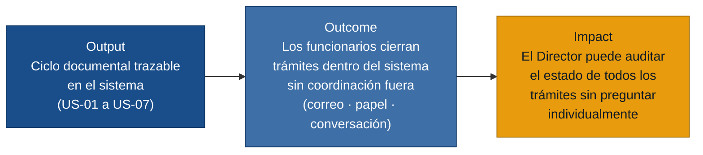

# MVP Canvas — Sistema de Gestión Documental

---

| Bloque | Contenido |
|---|---|
| **Propuesta de valor** | Cada trámite recibe un código único al ingresar, avanza de estado automáticamente conforme cada actor actúa en el sistema, y deja una línea de tiempo auditable — eliminando el ciclo informal de correos, papelitos y preguntas verbales que hoy es la única forma de saber dónde está un oficio. |
| **Segmento de usuarios** | Secretaria (registra y deriva), Director (delega y controla) y Colaborador (atiende y responde) del mismo departamento institucional. |
| **Funcionalidades mínimas** | 1. Registro con código único y metadatos obligatorios (US-01). 2. Bandeja "Por Despachar" con derivación automática al Director (US-02). 3. Delegación con sumilla digital al colaborador (US-03). 4. Bandeja personal del colaborador — solo sus trámites (US-04). 5. Carga de respuesta con vinculación automática y cambio de estado (US-05). 6. Línea de tiempo completa del trámite (US-06). 7. Control de acceso por departamento (US-07). |
| **Resultado esperado (outcome)** | Los funcionarios dejan de coordinar por correo o conversación verbal para conocer el estado de un trámite; todas las transiciones (recepción, derivación, delegación, respuesta) ocurren y quedan registradas dentro del sistema. |
| **Métrica de éxito** | ≥ 70 % de los trámites ingresados en los primeros 60 días de operación completan al menos dos transiciones de estado automáticas dentro del sistema (Ingresado → Derivado → Asignado o superior) sin que ningún actor haya coordinado fuera del sistema para lograrlo. **Prueba ácida:** si este porcentaje sube, el Director puede decidir confiar en el sistema para hacer seguimiento en lugar de preguntar individualmente a cada funcionario — ese cambio de comportamiento es la decisión que la métrica activa. |
| **Riesgos / supuestos** | 1. Los funcionarios adoptarán el flujo digital sin seguir derivando por correo en paralelo. 2. La Secretaria escaneará y registrará cada oficio en papel el mismo día que llega, sin acumulación. 3. La institución dispone de infraestructura mínima (servidor local o nube) con conectividad estable. 4. El Director dará instrucciones siempre mediante sumilla en el sistema, no solo cuando le resulte conveniente. |
| **Fuera de alcance (por ahora)** | • **Firma digital p12 en línea (R-06):** integración técnica compleja; la firma en papel no bloquea el flujo digital en v1. • **Dashboard de indicadores (R-07):** la línea de tiempo (US-06) da visibilidad básica; el panel completo es v2. • **Plantillas con membrete institucional (R-04):** Word funciona para redactar; las plantillas son mejora de eficiencia, no de trazabilidad. • **Cierre formal de expediente (R-05):** sin flujo activo validado primero, el proceso de cierre no aporta valor real. • **Reasignación masiva por ausencia (R-09):** caso de borde de baja frecuencia; la delegación unitaria (US-03) cubre la necesidad cotidiana. • **Búsqueda avanzada (R-12):** la bandeja personal es suficiente en v1. • **Alertas en tiempo real (R-14):** la etiqueta "Nuevo" en la bandeja cubre la necesidad mínima. • **Expediente en árbol jerárquico (R-15):** alta complejidad de UX; la línea de tiempo es el registro suficiente. |
