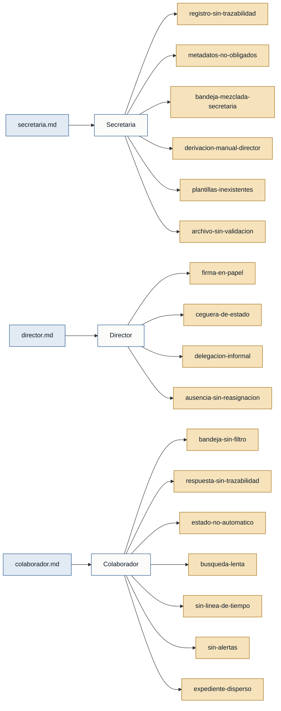

# Personas — Gestión Documental

---

## Personas

### Secretaria — secretaria
- **Contexto:** funcionaria de la institución responsable de recibir, registrar, derivar y archivar la documentación externa e interna que ingresa a la dirección.
- **Objetivo principal:** mantener el flujo documental ordenado y trazable desde que llega un oficio en papel hasta que el expediente se archiva definitivamente.
- **Dolores:**
  - Documentos llegan en papel y pueden traspapelarse si no se registran de inmediato; el sistema no genera código único automático (`secretaria.md`).
  - El sistema no obliga a completar campos clave al registrar un documento, lo que hace imposible la búsqueda posterior (`secretaria.md`).
  - No existe bandeja diferenciada; los documentos registrados se mezclan con todos los demás en la vista principal (`secretaria.md`).
  - La derivación al Director se realiza de forma informal (conversación o correo); no hay cambio automático de estado en el sistema (`secretaria.md`).
  - Redactar documentos oficiales implica buscar archivos Word anteriores y borrar datos, con riesgo de romper el formato institucional (`secretaria.md`).
  - Los expedientes completados permanecen mezclados con los activos; no existe un proceso de cierre formal con validación (`secretaria.md`).
- **Respaldo:** `primera mano` — entrevista `secretaria.md`.

---

### Director — director
- **Contexto:** jefe del departamento, responsable de aprobar, firmar con certificado p12, delegar y supervisar el cumplimiento de plazos de los trámites institucionales.
- **Objetivo principal:** tener visibilidad completa del estado de los trámites, delegar con instrucciones claras y firmar documentos sin depender de papel físico impreso.
- **Dolores:**
  - Los documentos se imprimen para recibir la firma digital, paralizando el flujo cuando el Director está fuera de la oficina o en reuniones (`director.md`).
  - No tiene visibilidad del estado de los trámites sin preguntar individualmente a cada funcionario, lo que lo deja "a ciegas" (`director.md`).
  - La delegación de trabajo se hace con papelitos o correos que no quedan registrados en el sistema ni llevan sumilla formal (`director.md`).
  - Cuando un funcionario se ausenta, sus trámites activos quedan congelados en su usuario sin mecanismo de reasignación masiva ni historial auditable (`director.md`).
- **Respaldo:** `primera mano` — entrevista `director.md`.

---

### Colaborador — colaborador
- **Contexto:** funcionario técnico que atiende los trámites asignados por el Director, redacta respuestas e informes, y consulta antecedentes de casos anteriores.
- **Objetivo principal:** atender únicamente sus trámites asignados de forma ordenada, responder con trazabilidad completa y enterarse a tiempo de nuevas asignaciones y vencimientos de plazos.
- **Dolores:**
  - La bandeja muestra documentos de todas las áreas de la institución, no solo los asignados directamente al colaborador (`colaborador.md`).
  - La respuesta (PDF redactado en Word) no queda vinculada automáticamente al documento origen; se pierde la trazabilidad del trámite (`colaborador.md`).
  - El estado del trámite no cambia automáticamente al guardar la respuesta; jefe y secretaria no saben que el colaborador ya cumplió (`colaborador.md`).
  - El buscador solo funciona con el código exacto del trámite; no soporta palabras clave parciales ni filtros por fecha (`colaborador.md`).
  - No hay historial visible del ciclo de vida del trámite (quién creó, quién puso sumilla, quién respondió y en qué fecha) (`colaborador.md`).
  - No existen notificaciones en tiempo real sobre nuevas asignaciones ni sobre vencimientos de plazos; hay que refrescar la página manualmente (`colaborador.md`).
  - Documentos relacionados de un mismo caso (informes, memorandos, anexos) quedan dispersos en el sistema sin opción de vincularlos a un trámite madre (`colaborador.md`).
- **Respaldo:** `primera mano` — entrevista `colaborador.md`.

---

## Stakeholders

### Ciudadano / Remitente externo
- **Interés en el sistema:** que sus solicitudes y oficios sean recibidos, registrados con código trazable y respondidos dentro del plazo institucional.
- **Fuente:** `secretaria.md` — mencionado como "la gente o los mensajeros que traen oficios de afuera".
- **Nota:** actor externo; no usa el sistema directamente. Sin entrevista de primera mano.

### La institución (como organismo)
- **Interés en el sistema:** cumplir plazos legales de respuesta, mantener imagen institucional consistente en documentos oficiales y garantizar trazabilidad de toda la gestión documental.
- **Fuente:** implícito en `secretaria.md`, `director.md` y `colaborador.md`.
