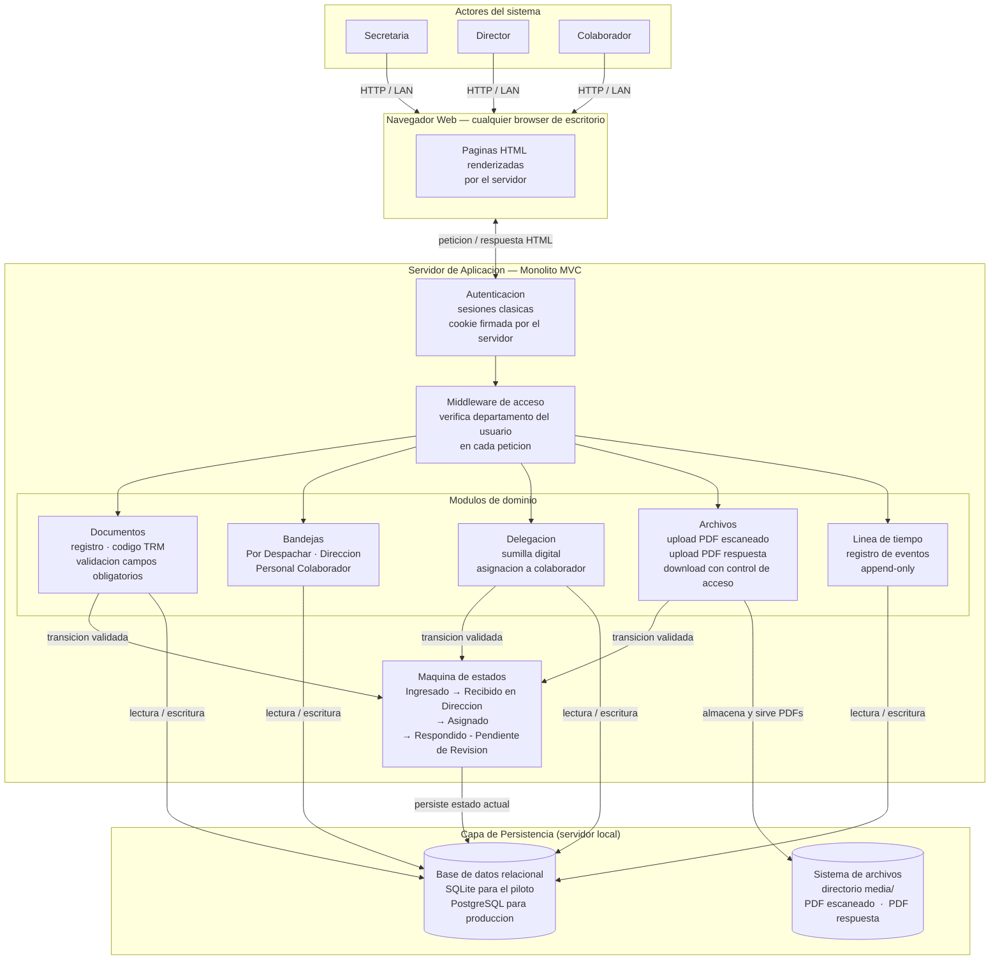

# Arquitectura del Sistema — Gestion Documental
> Delivery: gestionDocumental | Fecha: 2026-06-28 | Autor: Architect

---

## Contexto

El sistema digitaliza el ciclo documental de un departamento institucional de tamanio piloto: tres actores (Secretaria, Director, Colaborador), cuatro estados de tramite, dos tipos de archivos PDF y una capacidad de carga muy baja en v1 (un departamento, un equipo reducido).

Las restricciones que mas condicionan la arquitectura son:

- **Infraestructura incierta (Riesgo 3, mvp-canvas):** la institucion puede no tener nube publica; el sistema debe poder desplegarse en un servidor local con configuracion minima, sin personal de DevOps especializado.
- **Carga baja y dominio simple:** tres usuarios en el piloto; cuatro estados lineales sin bifurcaciones; ciclo cerrado (no hay integraciones externas en v1).
- **Modulo admin fuera de alcance en v1 (OQ-02 resuelto, backlog.json):** los usuarios se pre-cargan mediante datos iniciales; no hay pantalla de gestion de usuarios.
- **Fuera de alcance (mvp-canvas):** firma digital p12, dashboard de indicadores, alertas en tiempo real, busqueda avanzada, expediente jerarquico.

La arquitectura maximiza lo que NO hay que construir: un monolito con renderizado en servidor, una base de datos relacional embebida para el piloto y el sistema de archivos del SO para los PDFs.

---

## Diagrama de componentes

---

## Componentes principales

| Componente | Responsabilidad | Tecnologia propuesta |
|---|---|---|
| Navegador web | Interfaz de usuario; muestra las vistas HTML que genera el servidor | Cualquier browser de escritorio (Chrome, Firefox, Edge) |
| Servidor de aplicacion (monolito MVC) | Procesa peticiones, ejecuta logica de negocio, genera HTML | Django (Python) — framework MVC maduro con ORM, autenticacion y manejo de archivos integrados |
| Modulo Documentos | Genera codigo TRM-AAAA-NNNN secuencial e inmutable; valida campos obligatorios (R-01, R-02) | Modelo Django + generador de secuencia transaccional |
| Modulo Bandejas | Filtra y presenta documentos segun estado y usuario (US-02 AC-1, US-04 AC-1) | Vistas Django con queries filtradas por estado y por usuario.departamento |
| Modulo Delegacion | Registra sumilla digital obligatoria y asigna colaborador (R-08, US-03) | Formulario Django con validacion de minimo de caracteres |
| Modulo Archivos | Recibe PDFs, los almacena en media/, los sirve con verificacion de acceso (R-01, R-11) | FileField de Django; view de descarga con verificacion de departamento |
| Modulo Linea de tiempo | Registra y muestra eventos cronologicos con actor y timestamp (R-13, US-06) | Tabla `evento_tramite` append-only; vista de historial |
| Maquina de estados | Valida y ejecuta las cuatro transiciones del ciclo documental | Campo enum `estado` en tabla `documento` + logica de transicion en capa de servicio |
| Middleware de acceso | Verifica en cada peticion que el documento pertenece al departamento del usuario (R-16, US-07) | Decorador/mixin de Django aplicado a todas las vistas de documento |
| Autenticacion (sesiones) | Identifica al usuario y mantiene la sesion sin token externo | Sistema de sesiones nativo de Django (cookie firmada, estado en BD) |
| Base de datos relacional | Persiste documentos, usuarios, eventos, metadatos | SQLite (piloto, cero configuracion) / PostgreSQL (produccion, cuando escale a multiples departamentos) |
| Sistema de archivos (media/) | Almacena PDFs sin ocupar espacio en la BD | Directorio configurable en el sistema de archivos del servidor |

---

## Decisiones clave — mapa de ADRs

| ADR | Titulo | Estado |
|---|---|---|
| [ADR-0001](adr/ADR-0001-monolito-mvc.md) | Estilo de aplicacion: monolito MVC con renderizado en servidor | Aceptado |
| [ADR-0002](adr/ADR-0002-maquina-de-estados.md) | Maquina de estados del documento: campo enum + tabla de eventos append-only | Aceptado |
| [ADR-0003](adr/ADR-0003-almacenamiento-archivos.md) | Almacenamiento de archivos: sistema de archivos local (directorio media/) | Aceptado |
| [ADR-0004](adr/ADR-0004-control-de-acceso.md) | Control de acceso por departamento: RBAC simple con verificacion en capa de servicio | Aceptado |
| [ADR-0005](adr/ADR-0005-registro-de-eventos.md) | Registro de eventos (linea de tiempo): tabla append-only con metadata JSON | Aceptado |
| [ADR-0006](adr/ADR-0006-autenticacion-sesiones.md) | Autenticacion: sesiones clasicas del framework (sin JWT) | Aceptado |

---

## Open questions arquitectonicas

Las siguientes decisiones no son necesarias para el MVP v1. Se declaran explicitamente como preguntas abiertas para no sobre-disenar.

| ID | Pregunta | Por que no se decide ahora |
|---|---|---|
| OQ-A1 | Motor de base de datos definitivo: SQLite (piloto) o PostgreSQL (produccion) | El piloto arranca con un departamento y carga minima (mvp-canvas: riesgo 3 resuelto en backlog OQ-01). SQLite es suficiente hasta que haya evidencia de escala. La migracion es trivial con el ORM de Django. |
| OQ-A2 | Modo exacto de despliegue en el servidor local | El inbox no especifica el sistema operativo ni la configuracion del servidor institucional. Decidir entre servicio systemd, script de inicio manual o contenedor Docker requiere conocer ese contexto antes del despliegue real. |
| OQ-A3 | HTTPS / TLS | Necesario si hay acceso fuera de LAN o si la institucion lo exige por politica. El mvp-canvas no especifica si los usuarios acceden desde la misma red o desde fuera. |
| OQ-A4 | Estrategia de respaldo (backup) de base de datos y archivos PDF | No esta en el alcance del MVP ni en el inbox. Debe planificarse antes del despliegue en produccion con datos reales. |
| OQ-A5 | Mecanismo de medicion de la metrica de exito (OQ-04 del PO) | El dashboard (R-07) esta fuera de alcance. Sin el, medir que el 70% de tramites completan 2 transiciones requiere o una consulta SQL manual o un script puntual. Esta decision es operacional, no arquitectonica, pero impacta en si se necesita algun tipo de exportacion de datos. |
