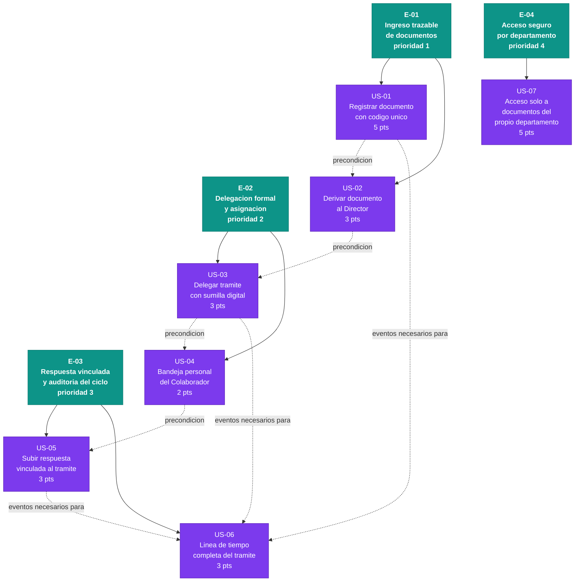

# Épicas del MVP — Sistema de Gestión Documental

> Fuente de verdad: `inbox/mvp-canvas.md`, `inbox/user-stories.md`,
> `inbox/requisitos.md`, `inbox/personas.md`, `inbox/evidence-map.json`
>
> Outcome del MVP: Los funcionarios cierran trámites dentro del sistema sin
> coordinación fuera (correo, papel, conversación verbal).
>
> Metrica de exito: >= 70% de tramites ingresados completan >= 2 transiciones
> de estado automaticas en los primeros 60 dias (Ingresado->Derivado->Asignado
> o superior) sin coordinacion fuera del sistema.

---

## E-01 · Ingreso trazable de documentos

**Valor (outcome):** La Secretaria cierra el ciclo de recepcion — registro y derivacion — completamente dentro del sistema: el oficio queda identificado con codigo unico desde el primer segundo y llega a la bandeja del Director sin un solo correo de aviso ni conversacion informal.

**Origen:**
- `mvp-canvas.md` — Funcionalidades minimas 1 y 2 (US-01, US-02); propuesta de valor ("cada tramite recibe un codigo unico al ingresar")
- `requisitos.md` — R-01 (codigo unico + metadatos obligatorios), R-02 (validacion campos obligatorios), R-03 (bandeja Por Despachar + derivacion automatica)
- `personas.md` — Secretaria: dolores `registro-sin-trazabilidad`, `metadatos-no-obligados`, `bandeja-mezclada-secretaria`, `derivacion-manual-director`
- `evidence-map.json` — pains: registro-sin-trazabilidad, metadatos-no-obligados, bandeja-mezclada-secretaria, derivacion-manual-director (fuente: secretaria.md)

**Prioridad:** 1

**Historias:** US-01, US-02

**Justificacion de prioridad:** Sin el objeto documental (codigo, metadatos, PDF escaneado) no hay nada que delegar, responder ni auditar; es la entrada absoluta del ciclo y desbloquea las tres epicas restantes.

---

## E-02 · Delegacion formal y asignacion

**Valor (outcome):** El Director delega con instruccion escrita y auditada dentro del sistema, y el Colaborador trabaja unicamente su propia cola de tramites: desaparecen los papelitos, los correos de delegacion y la confusion de quien debe atender que.

**Origen:**
- `mvp-canvas.md` — Funcionalidades minimas 3 y 4 (US-03, US-04); outcome ("funcionarios cierran tramites dentro del sistema sin coordinacion fuera")
- `requisitos.md` — R-08 (delegacion con sumilla digital), R-10 (bandeja personal colaborador)
- `personas.md` — Director: dolores `delegacion-informal`, `ceguera-de-estado`; Colaborador: dolor `bandeja-sin-filtro`
- `evidence-map.json` — pains: delegacion-informal, ceguera-de-estado, bandeja-sin-filtro (fuentes: director.md, colaborador.md)

**Prioridad:** 2

**Historias:** US-03, US-04

**Justificacion de prioridad:** Es el segundo paso critico del ciclo: sin delegacion formal el Colaborador no tiene tramites que atender y E-03 carece de trámites en estado "Asignado" sobre los que operar.

---

## E-03 · Respuesta vinculada y auditoria del ciclo

**Valor (outcome):** El Colaborador cierra el tramite subiendo la respuesta en el sistema sin avisar por correo, y cualquier actor autorizado puede ver en un solo lugar toda la linea de tiempo del oficio. Este comportamiento es el que activa directamente la metrica de exito del MVP (>= 2 transiciones de estado automaticas).

**Origen:**
- `mvp-canvas.md` — Funcionalidades minimas 5 y 6 (US-05, US-06); metrica de exito (>= 70% con >= 2 transiciones); impact ("el Director puede auditar el estado de todos los tramites sin preguntar individualmente")
- `requisitos.md` — R-11 (vinculacion respuesta + cambio de estado automatico), R-13 (linea de tiempo completa)
- `personas.md` — Colaborador: dolores `respuesta-sin-trazabilidad`, `estado-no-automatico`, `sin-linea-de-tiempo`; Director: dolor `ceguera-de-estado`
- `evidence-map.json` — pains: respuesta-sin-trazabilidad, estado-no-automatico, sin-linea-de-tiempo, ceguera-de-estado (fuentes: colaborador.md, director.md)

**Prioridad:** 3

**Historias:** US-05, US-06

**Justificacion de prioridad:** Completa el ciclo documental end-to-end y es el mecanismo que hace medible el outcome del MVP; sin la respuesta vinculada y la linea de tiempo el Director sigue preguntando individualmente, que es exactamente lo que el MVP promete eliminar.

---

## E-04 · Acceso seguro por departamento

**Valor (outcome):** Cada usuario ve unicamente los documentos de su departamento: los datos sensibles de cada area quedan aislados y la adopcion del sistema no exige confianza ciega entre areas, eliminando el riesgo de exposicion accidental por URL directa o busqueda.

**Origen:**
- `mvp-canvas.md` — Funcionalidad minima 7 (US-07)
- `requisitos.md` — R-16 (control de acceso por departamento — requisito no funcional de seguridad)
- `personas.md` — Colaborador: dolor `bandeja-sin-filtro` (origen compartido con R-16)
- `user-stories.md` — US-07 (criterio "Sin permiso" en acceso por URL directa, filtrado en busqueda, configuracion de perfil admin)
- `evidence-map.json` — pain: bandeja-sin-filtro (fuente: colaborador.md)

**Prioridad:** 4

**Historias:** US-07

**Justificacion de prioridad:** Fundacion de seguridad que puede desarrollarse en paralelo con E-02/E-03; la metrica de exito no la exige primero, pero debe estar lista antes del despliegue en entornos multi-departamento — postergar a cuarto puesto es valido unicamente si el piloto arranca con un departamento unico (ver OQ-01).

---

## Diagrama del backlog

**Total estimado del MVP:** 24 puntos de historia distribuidos en 4 epicas y 7 historias candidatas.

---

## Preguntas abiertas (open_questions del PO)

Estas situaciones no tienen respaldo suficiente en el inbox y no se afirman como historias ni como hechos. Se declaran como supuestos pendientes de validacion antes del refinamiento.

| ID | Pregunta | Impacto si no se resuelve |
|----|----------|--------------------------|
| OQ-01 | El piloto inicial, arranca con un solo departamento o con varios simultaneamente? | Define si E-04 debe moverse antes de E-02/E-03 o puede ir en paralelo al final |
| OQ-02 | Quien es el "administrador" que crea usuarios y asocia departamentos (criterio 3 de US-07)? Es un perfil separado o el propio Director? | El alcance real de US-07 puede crecer significativamente si implica un modulo de administracion de usuarios |
| OQ-03 | Que transicion de estado ocurre despues de "Respondido - Pendiente de Revision"? El Director revisa y cierra? O el tramite queda en ese estado indefinidamente en v1? | Sin una accion de cierre, el ciclo documental queda tecnicamente abierto y la metrica de exito puede ser ambigua |
| OQ-04 | Como se medira operacionalmente la metrica de exito (>= 70% con >= 2 transiciones) si el dashboard de indicadores (R-07) esta fuera de alcance en v1? | Sin mecanismo de medicion no se puede confirmar que el outcome se alcanzo |
